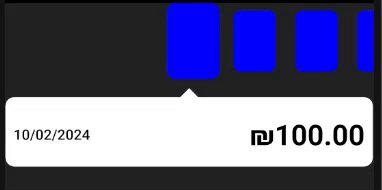

- A react native custom component of a animated carusel with tooltip, in typescript.

- It comes with a built-in TypeScript typings and is compatible with all popular JavaScript frameworks. You can use it directly or leverage well-maintained wrapper packages that allow for a more native integration with your frameworks of choice.

# Example:



## How to use:

```
import Loading from 'react-native-carusel-tooltip';

  <CircularCarousel
        numOfVisibleItems={7}
        spacing={10}
        tooltipContentView={
          <View style={styles.conteinerContent}>
            <View style={styles.row}>
              <Text style={styles.date}>{`${data[selectedIndex].date}`}</Text>
              <Text style={styles.mainAmount}>{`₪${data[
                selectedIndex
              ].amount.toFixed(2)}`}</Text>
            </View>
          </View>
        }
        selectetItemIndex={selectedIndex}
        setSelectetItemIndex={setSelectedIndex}
        data={data}
        rectStyle={{backgroundColor: "blue"}}
      />
```

# Props -

| Name                    | Type                     | Default |
| ----------------------- | ------------------------ | ------- |
| data                    | any[]                    |
| tooltipContentView      | React.ReactNode;         |
| selectetItemIndex       | number;                  |
| setSelectetItemIndex    | (index: number) => void; |
| numOfVisibleItems?      | number;                  |
| spacing?                | number;                  |
| rectStyle?              | ViewStyle;               |
| tooltipGradiant?        | string[];                |
| tooltipBorderColor?     | string;                  |
| tooltipBorderRadius?    | number;                  |
| tooltipBorderWidth?     | number;                  |
| tooltipBackgroundColor? | string;                  |
| showGradiant?           | boolean;                 |
| tooltiPwraperDetailes?  | ViewStyle                |
